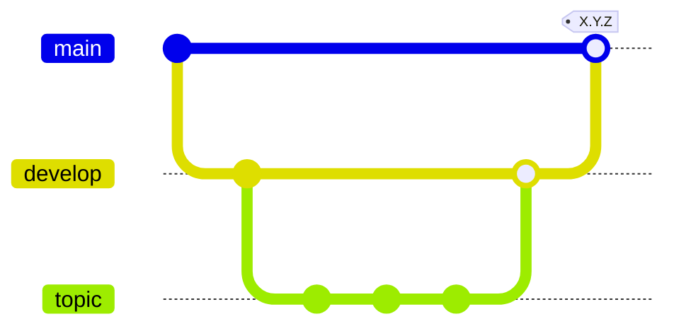
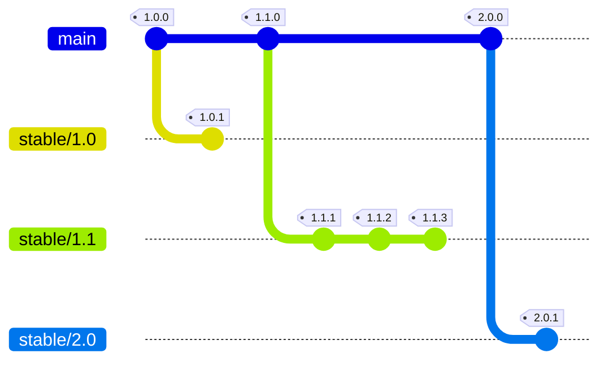

# コントリビューションガイド

本リポジトリにおける各成果物に対して変更を加える場合、以下のルールに従って管理してください。

各ルールは、必要に応じて次のようにラベリングしています。

- [MUST] 必ず守らなければいけないルール。
- [RECOMMENDED] 基本方針として推奨されるルール。プロジェクトごとに例外を定めることも許容します。
- [OPTIONAL] 推奨されるが、適用するかはメンバー各々で選択可能なルール。

## :twisted_rightwards_arrows: ブランチ戦略



### ブランチの分類

Git リポジトリ上で管理される開発物を適切にバージョン管理するため、次のような分類でブランチを分けて管理するものとします。

- [メインブランチ](#メインブランチ)
- [開発ブランチ](#開発ブランチ)
- [バージョン固有開発ブランチ](#バージョン固有開発ブランチ)
- [トピックブランチ](#トピックブランチ)
- [安定バージョンブランチ](#安定バージョンブランチ)

#### メインブランチ

メインブランチは、本番環境に反映されているべき成果物を管理するための根幹となるブランチで、次のルールを満たすものを指します。

- ブランチ名は `main` と命名されるものとします。 [MUST]
- 原則として常時全テスト・ビルドが通過する、デプロイ可能な状態とします。 [MUST]
- 基本的には開発ブランチからのマージでもって更新されていくものであり、急を要する、あるいは全体へ共有されるべきものでない限りは、マージでない直接的なコミットでの更新を許容しません。 [MUST]

#### 開発ブランチ

開発ブランチは、メインブランチから分岐し、開発・検証環境に反映されているべき開発段階 (結合・システムテスト対象) の成果物を管理するためのブランチで、次のルールを満たすものを指します。

- ブランチ名は `develop` と命名されるものとします。 [MUST]
- 原則として常時全テスト・ビルドが通過する、デプロイ可能な状態とします。 [MUST]
- メインブランチの最新リリースタグのコミットタグから分岐するものとします。[MUST]
- そのバージョンで開発すべき変更内容がすべて適用されて、リリース準備ができた時点でメインブランチにマージします。 [MUST]

#### バージョン固有開発ブランチ

バージョン固有開発ブランチは、複数のバージョンが並行して開発される場合に、各バージョンの開発を独立して管理するためのブランチです。

- ブランチ名は `develop-X.Y.0` と命名されるものとします。 (例: `develop-1.2.0`) [MUST]
- 原則として常時全テスト・ビルドが通過する、デプロイ可能な状態とします。 [MUST]
- メインブランチの最新リリースタグのコミットから分岐するものとします。 [MUST]
  - パッチバージョンの開発においては、対応する安定バージョンブランチ (`stable/X.Y`) を分岐元とします。 [MUST]
- 先行するバージョンがリリースされた際は、そのバージョン固有開発ブランチを後続の開発ブランチへマージし、バグ修正等を取り込むものとします。 [MUST]
- そのバージョンで開発すべき変更内容がすべて適用されて、リリース準備ができた時点でメインブランチにマージします。 [MUST]
  - パッチバージョンの開発である場合、分岐元の安定バージョンブランチへマージします。 [MUST]

> [!WARNING]
> 複数のバージョンを並行して開発する必要がない場合は、バージョン固有開発ブランチが用いられる必要はない点に留意してください。

#### トピックブランチ

トピックブランチは、各トピック (開発・修正対象やチケットなど) ごとに開発ブランチ、またはバージョン固有開発ブランチから分岐する、作業中の成果物を管理するためのブランチで、次のルールを満たすものを指します。

- 1 つのトピックブランチは、 **原則として 1 つのチケット/タスクに対応する** ものとします。 [MUST]
  - 複数のチケットに対応する変更を 1 つのブランチに混在させると、後から特定の変更を `git revert` で打ち消せなくなるためです。
- 作業内容や開発対象、またはチケット管理システム上のチケット ID や SCM サービスの Issue ID などをもとに、 `topic/[branch-name]` と命名されるものとします。 [RECOMMENDED]
  - 例: `topic/user-management`, `topic/ticket-123`, `topic/issue-123`
- 個人的な作業分類を目的として、トピックブランチから任意のサブブランチへと分岐することも許容されます。 [OPTIONAL]
- 作業が完了したトピックブランチは、分岐元へマージされたのち、以降不要なブランチとし削除されるものとします。 [MUST]

#### 安定バージョンブランチ

安定バージョンブランチは、リリース済みのバージョンを製品サポート対象として継続的に維持・管理するためのブランチです。通常の開発ライン (`main` / `develop`) とは独立して、パッチバージョンのリリースを管理します。

- ブランチ名は `stable/X.Y` と命名されるものとします。(例: `stable/1.0`) [MUST]
- 対応するマイナーバージョンのリリースタグ (`X.Y.0`) のコミット、すなわち開発ブランチからメインブランチへのマージコミットから分岐し、 `X.Y.0` のリリースと同時に作成するものとします。 [MUST]
- 原則として常時全テスト・ビルドが通過する、デプロイ可能な状態とします。 [MUST]
- 安定バージョンブランチへの変更は、バージョン固有開発ブランチからのマージによってのみ行われるものとします。直接コミットは許容しません。 [MUST]
- パッチバージョンのリリースタグ (`X.Y.Z`) は、安定バージョンブランチ上のマージコミットを対象として付与されるものとします。 [MUST]

> [!NOTE]
> パッチバージョンの開発が必要になった場合は、安定バージョンブランチを分岐元としてバージョン固有開発ブランチ (`develop-X.Y.Z`) を作成し、そこからトピックブランチを分岐させて開発を進めます。開発完了後はバージョン固有開発ブランチを安定バージョンブランチへマージし、パッチバージョンのタグを付与します。

### ブランチのマージ

- ブランチのマージは、原則として PR/MR を介して実行されるものとします。 [MUST]
- マージの方向は原則 [作業ブランチ] → [分岐元ブランチ] となるようにしてください。 [MUST]
- マージはマージコミットが作成される **Merge commit (通常マージ) を使用** し、 **Squash merge は使用しない** ものとします。 [MUST]
  - Squash merge を使用するとマージコミットが残らず、後から `git revert` で特定のトピックブランチの変更を打ち消せなくなるためです。

## :bookmark: リリースバージョン管理



「本番環境へ反映され、運用されているバージョン」を **「リリースバージョン」** として次のように管理します。

- 各リリースバージョンは、[Git タグ](https://git-scm.com/book/ja/v2/Git-の基本-タグ) として管理されるものとします。 [MUST]
- 各リリースバージョンは、 [Semantic Versioning 2.0](https://semver.org/lang/ja/) の原則に従い、 `X.Y.Z` のように命名されるものとします。 (例: `1.2.3`) [MUST]
  - メジャーバージョン `X` は、 `1` を初期値とし、既存のモジュールから大きく考え方を変え、全体的なインターフェースに変更がある場合に `1` ずつ加算されるものとします。 (例: `1.0.0` → `2.0.0` → `3.0.0`)
  - マイナーバージョン `Y` は、メジャーバージョンごとに `0` を初期値とし、主にコンポーネントの機能改修など、新規機能の追加、または既存の機能に対する更新がある場合に `1` ずつ加算されるものとします。 (例: `3.0.0` → `3.1.0` → `3.2.0`)
  - パッチバージョン `Z` は、マイナーバージョンごとに `0` を初期値とし、本番環境へ導入後のリリースバージョンに対して、既存機能のバグ修正や単純な設定変更といった軽微な変更がある場合に `1` ずつ加算されるものとします。 (例: `3.2.0` → `3.2.1` → `3.2.2`)
  - システム上の制約でバージョン・マイルストーンに相当する概念が、数字で開始することが認められていない場合のみ、 `v1.2.3` のように先頭に `v` を付与することを許容します。
- メジャー / マイナーバージョンを示す Git タグ (`X.0.0` / `X.Y.0`) は、開発ブランチからメインブランチへのマージ後、 **メインブランチ上のマージコミットを対象として付与** されるものとします。 [MUST]
- パッチバージョンを示す Git タグ (`X.Y.Z`) は、バージョン固有開発ブランチから安定バージョンブランチへのマージ後、 **安定バージョンブランチ上のマージコミットを対象として付与** されるものとします。 [MUST]
- 各リリースバージョンは、原則として SCM サービスないしチケット管理システム上のマイルストーン (またはそれに相当する概念) と一致しているものします [RECOMMENDED]

### バージョニングの例

例えば、現在のリリースバージョンが `1.0.0` であるとすると

- 機能の追加・改修を含む次のバージョンは `1.1.0`
- バグ修正やホットフィックスがあった場合、その修正を含む次のバージョンは `1.0.1`
- 大きく考え方を変えたり、インターフェースレベルの変更を含む次のバージョンは `2.0.0`

当然、「新機能の開発」と「既存バージョンのバグフィックス」は同時に進行することが考えられますので、
それぞれのバージョンに関する開発が並行で行われることは、十分あり得る点に留意してください。

## :pencil2: コミットの基本ルール

### コミットメッセージ

- コミットメッセージは日本語で記載してください。 [MUST]
- コミットメッセージの1行目 (`git log --oneline` にて表示される部分) は、「**どの機能に対して**」、「**なぜ/どんな変更をしたのか**」を要約して、50字以内を目安に記載してください。 [MUST]
  - 字数はあくまで目安としてください。明快であればオーバーすること自体は問題ありません。
- コミットメッセージの3行目以降に、変更内容の概要説明や変更理由の概略を記載してください。 (2行目は空行) [RECOMMENDED]
  - 1行目のメッセージで説明が十分である場合は3行目以降の記載は必要はありません。
- コミットメッセージは、できるだけ具体的なファイル名やクラス名などの物理名を避け、お客様が認識できるレイヤーの言葉 (基本設計レベルで記載されている文言) を用いて記載してください。 [RECOMMENDED]
- コミットに対して Issue やチケット管理システム上で発行されたチケットが紐づいている場合、メッセージの冒頭にチケット番号を記載してください。 [RECOMMENDED]
- コミットに関連するチケットやリンクがある場合、コミットメッセージの最後にその URL を記載してください。 [OPTIONAL]
- 検索しやすさのため、メッセージの文頭に [Emoji Prefix](#emoji-prefix) (後述) の記述を推奨します。 [OPTIONAL]

### コミットの粒度

各変更に対してどの程度のまとまりを1つのコミットとするかについては、以下を参考にしてください。

#### 大きすぎるコミットの指標

以下を満たさない場合、コミットの粒度が大きすぎる可能性があります。 必要に応じて分割するなどを検討してください。

- コミットに含まれる変更内容を、1行かつ句読点なしで説明可能である。
- 1つのコミットに、複数のタスク/チケットに対応する変更内容が含まれない。 (タスク/チケットとコミットが1対1に紐づく)
- [git revert](https://www.atlassian.com/ja/git/tutorials/undoing-changes/git-revert) で打ち消すことが可能である。 (そのコミットを revert することによって余計な戻りが発生しない)

#### 小さすぎるコミットの指標

また、以下を満たさない場合はコミットの粒度が小さすぎる可能性があります。必要に応じて関連するコミットをまとめるなどを検討してください。

- コミットメッセージが変更の **目的や対象機能** を含んでいること。
  - 例えば、「修正」「調整」のみのコミットメッセージなどは変更目的が不明であり不適切です。
- 前後のコミットなしに、そのコミット単独で変更目的が説明できること。

なお、作業中のトピックブランチにおいてはいかなる粒度でコミットされることも許容します。ただし、少なくともマージされる直前までに [対話的なリベース操作](https://git-scm.com/book/ja/v2/Git-%E3%81%AE%E3%81%95%E3%81%BE%E3%81%96%E3%81%BE%E3%81%AA%E3%83%84%E3%83%BC%E3%83%AB-%E6%AD%B4%E5%8F%B2%E3%81%AE%E6%9B%B8%E3%81%8D%E6%8F%9B%E3%81%88) 等で適切な粒度に整理されるものとします。

### コミットメッセージの例

```plaintext
:sparkles: [#123] 新規コンポーネント機能 Sample を追加
```

```plaintext
:memo: コミットテンプレートを追加

- コミットテンプレートを追加
- コントリビューションガイドを追加
- 各種ドキュメントへのリンクを README へ追記
```

```plaintext
:bug: [#123] コンポーネント機能 Sample においてタイトルが正しく表示されない問題に対応

サンプルコンテンツを表示するためのコンポーネント機能 Sample において、
ダイアログを介して入力されたタイトルが正しく表示されない問題を確認。

参照されるプロパティが設計書通りでなかったため、関連ソースを修正。

https://example.com/some-project/issues/123
```

> [!NOTE]
> プログラミングの世界に「3日後の自分は他人」という格言があるように、開発物は時間とともに「どうしてこの変更をしたか」という変更の **理由・意味** が急速に風化し失われていきます。
> Git リポジトリに対するコミットとコミットメッセージは、その意味とコードを直接紐づけられる数少ない要素であり、コードの保守性にも結び付きます。
> 将来開発に関わるメンバー全員のためにも、コミットの粒度とメッセージについておろそかにしないようにしてください。

### Emoji Prefix

Emoji Prefix は、 Git ツールやサービスの多くが `:sparkles:` (:sparkles:) のような [絵文字コード](https://www.webfx.com/tools/emoji-cheat-sheet/) による絵文字の表示をサポートしていることを利用し、コミットメッセージの文頭に変更内容のカテゴリーを示す絵文字を付与することで、変更の視認性・検索容易性を向上させるための取り組みです。

各コミットに対し、以下より1つ選択して文頭に記述するようにしてください。

| カテゴリー                                    | コード                   | 説明                                                                                                          |
| --------------------------------------------- | ------------------------ | ------------------------------------------------------------------------------------------------------------- |
| ✨ 新機能                                     | `:sparkles:`             | 新機能・新要素の追加                                                                                          |
| ♻️ リファクタリング                           | `:recycle:`              | 機能の振る舞いへの変更を伴わない、内部的な構造・設計・実装の改善                                              |
| 📝 ドキュメンテーション                       | `:memo:`                 | ドキュメントに関連するファイルの追加・更新                                                                    |
| 🐛 バグ修正・不具合対応                       | `:bug:`                  | バグ修正・不具合対応に関連する変更                                                                            |
| 🚑️ ホットフィックス                           | `:ambulance:`            | 緊急性の高い問題への対応                                                                                      |
| 🔥 不要ファイルの削除                         | `:fire:`                 | 不要となったファイルの断捨離                                                                                  |
| 🚚 移動・リネーム                             | `:truck:`                | ファイル・ディレクトリの移動・リネーム                                                                        |
| 💄 UI/スタイルの変更                          | `:lipstick:`             | UI に関連するファイル、 CSS などのスタイルに関するファイルの変更                                              |
| 📱 デバイス別対応                             | `:iphone:`               | デバイスごとのレスポンシブ対応など、デバイス依存の変更                                                        |
| ✅ テストの更新                               | `:white_check_mark:`     | テストコードの追加更新、またはテストに関連するファイルの更新                                                  |
| 🎨 ディレクトリ構造・フォーマットルールの変更 | `:art:`                  | ディレクトリ構造や、ソースコードのフォーマットルールに関する変更                                              |
| ⚡️ パフォーマンス改善                         | `:zap:`                  | パフォーマンス改善に関連する変更                                                                              |
| 🔒️ セキュリティ対応                           | `:lock:`                 | セキュリティ対応に関連する変更                                                                                |
| ♿️ アクセシビリティ対応                       | `:wheelchair:`           | アクセシビリティへの対応に関連する変更                                                                        |
| 🗃️ データベース関連の変更                     | `:card_file_box:`        | データベースのスキーマ変更など、データベース関連の変更に伴う変更                                              |
| 🧱 インフラ関連の変更                         | `:bricks:`               | インフラ設定やその変更に伴うプログラムの修正など、インフラ関連の変更                                          |
| 👽️ 外部 API 依存の変更                        | `:alien:`                | アプリケーション・システムが依存している外部の API における仕様変更等に伴う変更                               |
| 🔖 バージョン情報の更新                       | `:bookmark:`             | バージョン情報、変更履歴などバージョン更新に関連する変更                                                      |
| 🔧 設定ファイルの変更                         | `:wrench:`               | アプリケーション・システムが参照する設定ファイルの変更                                                        |
| 🔨 開発ツール・設定変更                       | `:hammer:`               | 開発用のスクリプト、エディタ設定など、開発作業に関連するファイルの変更                                        |
| 🤖 AI エージェントへの変更                    | `:robot:`                | AI エージェントの設定や規約に関する変更                                                                       |
| 💚 CI/CD                                      | `:green_heart:`          | ビルド設定、パイプライン設定の変更など、 CI/CD に関連する変更                                                 |
| 🚨 解析エラー対応                             | `:rotating_light:`       | リンターなどによる静的解析のエラー・警告等への対応を含む変更                                                  |
| ⬆️ 依存関係のアップデート                     | `:arrow_up:`             | 依存ライブラリ・パッケージのアップデートを含む変更                                                            |
| ⬇️ 依存関係のダウングレード                   | `:arrow_down:`           | 依存ライブラリ・パッケージのダウングレードを含む変更                                                          |
| ➕ 依存関係の追加                             | `:heavy_plus_sign:`      | 依存ライブラリ・パッケージの追加                                                                              |
| ➖ 依存関係の削除                             | `:heavy_minus_sign:`     | 依存ライブラリ・パッケージの削除                                                                              |
| 🌐 多言語化・ローカライズ                     | `:globe_with_meridians:` | 多言語化対応、ローカライズを含む i18n, l10n に関連した変更                                                    |
| 🍱 アセット更新                               | `:bento:`                | 画像や図表などのアセット類の更新                                                                              |
| ✏️ 誤字修正                                   | `:pencil2:`              | 誤字・誤植の修正                                                                                              |
| 💡 コメントの修正                             | `:bulb:`                 | ソースコード内のコメントの修正                                                                                |
| 🥅 エラー対応                                 | `:goal_net:`             | ビルドエラーなど、ツール等の開発上のエラー対応                                                                |
| ⚗️ 技術検証                                   | `:alembic:`              | 技術検証など、検証中の状態を含む変更                                                                          |
| 🚧 WIP                                        | `:construction:`         | 作業中の内容を含むコミット。原則としてこのコミットは、後ほど fixup / squash されることが求められます。 [MUST] |
